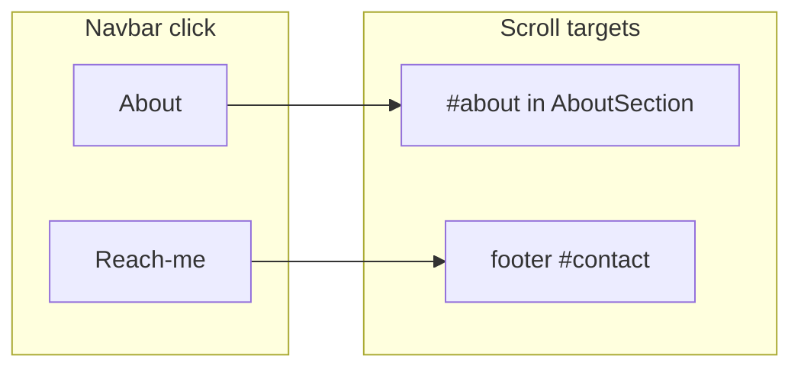

# Navbar: About → narrative, Reach-me → footer

## Context

- `[components/layout/navbar.tsx](components/layout/navbar.tsx)` already special-cases **Work**: on `/` it uses `href="/#work"`; off home it uses a button that opens the archive modal.
- `[components/sections/about-section.tsx](components/sections/about-section.tsx)` wraps the narrative in `<section id="about" className="scroll-mt-20 ...">` — this is the scroll target for “The Narrative” (eyebrow from `settings.aboutEyebrow`).
- `[components/layout/footer.tsx](components/layout/footer.tsx)` exposes the footer as `<footer id="contact" ...>` — use `**#contact`** as the anchor for “scroll to footer” (no new id required unless you prefer renaming to `footer` later for clarity).

## Intended behavior

| Nav item                            | On `/`              | On `/about`         | On any other `(main)` route (e.g. `/blog`, `/gallery`, `/work`) |
| ----------------------------------- | ------------------- | ------------------- | --------------------------------------------------------------- |
| **About** (CMS path `/about`)       | `Link` → `/#about`  | `Link` → `#about`   | `Link` → `/about#about`                                         |
| **Reach-me** (CMS path `/reach-me`) | `Link` → `#contact` | `Link` → `#contact` | `Link` → `#contact`                                             |

Rationale:

- **About**: Mirrors the Work pattern on the home page (`/#work` → `/#about`). On the standalone about route, a same-page `#about` avoids a redundant navigation. Elsewhere, `**/about#about`** matches the default nav destination (`/about`) and scrolls to the narrative block after navigation (same section component as on the home page).
- **Reach-me**: The footer is rendered in `[SiteShell](components/layout/site-shell.tsx)` below `<main>` on all routes under `[app/(main)/layout.tsx](app/(main)`/layout.tsx), so `**#contact`** always resolves on those pages. This overrides the default `/reach-me` route for the nav control only, per your request to land on the footer.

## Implementation steps

1. **Add helpers** next to `isWorkNavHref` in `[navbar.tsx](components/layout/navbar.tsx)`: e.g. `stripNavPath(href)`, `isAboutNavHref(href)`, `isReachMeNavHref(href)` (same path-stripping idea as Work: ignore `#` and `?` for matching CMS `item.href`).
2. **Insert branches** in the `settings.navItems.map` loop **before** the generic `return` (and after the Work branches), respecting `item.openInNewTab` — if true, keep `href={item.href}` unchanged.
3. **About branch**: If `isAboutNavHref` and not `openInNewTab`, render `Link` with `href` chosen from `pathname` as in the table above (`isHome`, `pathname === "/about"`, else fallback).
4. **Reach-me branch**: If `isReachMeNavHref` and not `openInNewTab`, render `Link` with `href="#contact"` (same for all pathnames under `(main)`).
5. **Optional polish**: If the sticky header ever overlaps the footer on hash scroll, add `scroll-mt-`* on the `<footer>` in `[footer.tsx](components/layout/footer.tsx)` to mirror `about-section` — only if you see overlap in manual testing.

## Files to touch

- Primary: `[components/layout/navbar.tsx](components/layout/navbar.tsx)`
- Optional: `[components/layout/footer.tsx](components/layout/footer.tsx)` — only if `scroll-mt` is needed after click testing

## Testing (manual)

- From `/`, `/blog`, `/gallery`, `/work`, `/about`: click **About** → lands on the narrative (`#about`) per table.
- From the same routes: click **Reach-me** → scrolls to the footer CTA/social strip (`#contact`).
- Confirm **Work** behavior unchanged (home `/#work`, off-home archive button).

## Note on Studio

Routes under `app/studio` do not use `SiteShell` / this navbar, so no change there.