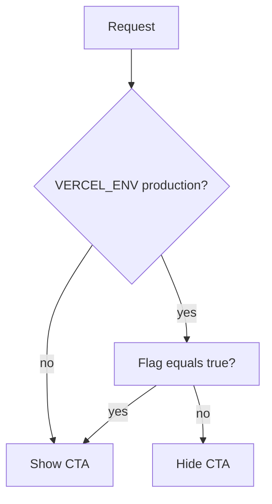

# Feature-flag: article newsletter CTA (Vercel Production only)

## Target

The green “Get the latest experiments in your inbox” block is `[ArticleNewsletterCta](components/blog/article-newsletter-cta.tsx)`, rendered from `[ArticleDetail](components/blog/article-detail.tsx)`.

## Approach: one toggle, Vercel Production only

Keep configuration **minimal**: a **single** server-only env var that is only consulted when the app runs on **Vercel Production** (`VERCEL_ENV === "production"`).


| Where                                                    | Behavior                                                                                                                            |
| -------------------------------------------------------- | ----------------------------------------------------------------------------------------------------------------------------------- |
| Local `next dev`, local `next start`, Vercel **Preview** | CTA **shown** (no env needed) — easy to iterate until the form is real.                                                             |
| **Vercel Production**                                    | CTA **shown** only when the one variable is exactly `"true"`; **unset or anything else → hidden** (safe default for the live site). |


**Variable name (suggested):** `ARTICLE_NEWSLETTER_CTA_ENABLED_IN_PRODUCTION`  
(Or shorter `ARTICLE_NEWSLETTER_CTA_ENABLED` with the doc clarifying it applies **only** on Vercel Production — pick one name in implementation and use it consistently.)

**Logic:**

```ts
// Pseudocode
if (process.env.VERCEL_ENV === "production") {
  return process.env.ARTICLE_NEWSLETTER_CTA_ENABLED_IN_PRODUCTION === "true";
}
return true;
```

No separate dev/preview flags — **cleaner**, and production is the only place you flip one switch in the Vercel UI when ready.




## Code changes

1. Add `[lib/feature-flags.ts](lib/feature-flags.ts)` with `isArticleNewsletterCtaEnabled(): boolean` as above.
2. In `[article-detail.tsx](components/blog/article-detail.tsx)`: `{isArticleNewsletterCtaEnabled() ? <ArticleNewsletterCta /> : null}`.
3. **Docs:** Comment at top of `feature-flags.ts` explaining the single var and that it applies only on Vercel Production; optional one line in `[README.md](README.md)` if the repo already lists env vars.

## Testing

- Local blog post → CTA visible without setting anything.
- Vercel Preview deployment → CTA visible.
- Vercel Production with var unset → CTA hidden; set to `true` → CTA visible.

