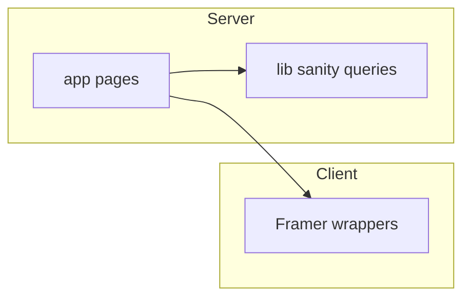

# Next.js portfolio: initialization and full stack setup

## Preconditions

- Workspace `[/Users/APPLE/aaade-portfolio-v2](/Users/APPLE/aaade-portfolio-v2)` is empty; all files will be created here.
- You will need a Sanity project (project ID + dataset) from [sanity.io/manage](https://www.sanity.io/manage); store them in `.env.local` as `NEXT_PUBLIC_SANITY_PROJECT_ID`, `NEXT_PUBLIC_SANITY_DATASET`, and optionally `SANITY_API_READ_TOKEN` for draft/private content later.

## Step 1: Initialize Next.js + tooling

- Run `create-next-app@latest` in the workspace with: **TypeScript**, **App Router**, **Tailwind**, **ESLint**, **no `src/` directory** (so routes live at `[app/](app/)` as specified).
- Add **Prettier** + **eslint-config-prettier** so ESLint and Prettier do not conflict; add scripts `format` / `format:check` in `[package.json](package.json)`.
- Add `[.prettierrc](.prettierrc)` (or `prettier.config.mjs`) and `[.prettierignore](.prettierignore)` mirroring `.gitignore`.
- **Absolute imports**: ensure `[tsconfig.json](tsconfig.json)` has `"paths": { "@/*": ["./*"] }` (create-next-app often adds `@/*` → `./src/*`; adjust to project root paths since you are not using `src/`).

## Step 2: Folder structure (match your spec)

Create the following (files filled in later steps):


| Area                                   | Path                                                                                                                                                                                                                                                              |
| -------------------------------------- | ----------------------------------------------------------------------------------------------------------------------------------------------------------------------------------------------------------------------------------------------------------------- |
| Main site (route group, URL still `/`) | `[app/(main)/layout.tsx](app/(main)`/layout.tsx), `[app/(main)/page.tsx](app/(main)`/page.tsx)                                                                                                                                                                    |
| Blog                                   | `[app/blog/page.tsx](app/blog/page.tsx)`, `[app/blog/[slug]/page.tsx](app/blog/[slug]/page.tsx)`                                                                                                                                                                  |
| Projects                               | `[app/projects/page.tsx](app/projects/page.tsx)`, `[app/projects/[slug]/page.tsx](app/projects/[slug]/page.tsx)`                                                                                                                                                  |
| Root layout + globals                  | `[app/layout.tsx](app/layout.tsx)`, `[app/globals.css](app/globals.css)` — **or** keep Tailwind entry as `[styles/globals.css](styles/globals.css)` and import it from `app/layout.tsx` (your spec prefers `styles/globals.css`; move/alias imports accordingly). |
| Components                             | `[components/ui/](components/ui/)`, `[components/layout/](components/layout/)`, `[components/sections/](components/sections/)`                                                                                                                                    |
| Lib                                    | `[lib/sanity.ts](lib/sanity.ts)`, `[lib/utils.ts](lib/utils.ts)` (e.g. `cn` with `clsx` + `tailwind-merge`)                                                                                                                                                       |
| Sanity                                 | `[sanity/schemas/](sanity/schemas/)` (blog, project, gallery), `[sanity/config/](sanity/config/)` (e.g. export `projectId` / `dataset` / `apiVersion` for reuse in Next + Studio)                                                                                 |
| Types                                  | `[types/sanity.ts](types/sanity.ts)` (or split by domain) for query result shapes                                                                                                                                                                                 |


Optional but **production-friendly**: add `[app/studio/[[...tool]]/page.tsx](app/studio/[[...tool]]/page.tsx)` with `next-sanity` studio route so one repo deploys site + CMS UI (you can skip if you prefer hosted Studio only).

## Step 3: Design system (Tailwind + base styles)

- Extend `[tailwind.config.ts](tailwind.config.ts)`:
  - **Primary olive palette** (e.g. `olive.50`–`olive.950` or CSS variables mapped in `theme.extend.colors`).
  - **Dark-first base**: `darkMode: 'class'` on `<html className="dark">` in root layout (or `media` if you prefer system-only; class is better for explicit control).
  - Optional `fontFamily`, `fontSize`, and `spacing` extensions only where they add real value; avoid token sprawl.
- In `[styles/globals.css](styles/globals.css)`: `@tailwind` directives, `body` background/text using olive/neutral tokens, and **typography primitives** as `@layer base` (e.g. `h1`–`h3`, `p`, links) plus **container** max-width and horizontal padding utilities or a `.container` class aligned with your `Container` component.
- **No inline styles** rule: all visual styling via Tailwind classes in components.

## Step 4: Core components

Implement small, composable pieces under `[components/ui/](components/ui/)` and `[components/layout/](components/layout/)`:

- `**Container`: max-width + horizontal padding, optional `as` polymorphism if useful.
- `**Section`: vertical spacing wrapper (padding/margin scale).
- `**Button`**: `variant` prop (`primary`, `secondary`, `ghost`, etc.) using `class-variance-authority` (CVA) or a minimal manual variant map — consistent with Tailwind only.
- `**Heading**`, `**Text**`: semantic tags + size/weight/color props mapped to classes.
- `**Navbar**`, `**Footer**`: minimal links to `/`, `/blog`, `/projects`; footer can hold copyright + social placeholders.

Use `[app/(main)/layout.tsx](app/(main)`/layout.tsx) to wrap main marketing pages with Navbar/Footer; `[app/blog/layout.tsx](app/blog/layout.tsx)` and `[app/projects/layout.tsx](app/projects/layout.tsx)` can reuse the same shell or a slimmer variant for subdomain-style consistency later.

## Step 5: Framer Motion + animation utilities

- Install `framer-motion`.
- Add `[lib/motion.ts](lib/motion.ts)` (or `[components/ui/motion.ts](components/ui/motion.ts)`) exporting reusable **variants** and **transition** presets: `fadeIn`, `slideUp`, `staggerContainer`, `staggerItem`.
- Export thin wrappers if needed: e.g. `FadeIn` / `SlideUp` client components that accept `children` and use `motion.div` — mark files with `"use client"` only where hooks/motion components are used; keep server components as the default for pages.




## Step 6: Sanity packages and schemas

- Install: `next-sanity`, `@sanity/client`, `@sanity/image-url`, `@portabletext/react`, and for Studio in-repo: `sanity`, `@sanity/vision` (optional).
- **Blog schema** `[sanity/schemas/blog.ts](sanity/schemas/blog.ts)`: `title` (string), `slug` (slug from title), `content` (array/block portable text), `coverImage` (image + hotspot), `category` (string or reference to a simple `category` doc — start with string for speed), `publishedAt` (datetime).
- **Project schema** `[sanity/schemas/project.ts](sanity/schemas/project.ts)`: `title`, `description` (text), `techStack` (array of string), `images` (array of image), `githubUrl`, `liveUrl` (url), `caseStudy` (block content).
- **Gallery schema** `[sanity/schemas/gallery.ts](sanity/schemas/gallery.ts)`: `image`, `caption` (string).
- Register all in `[sanity/schemas/index.ts](sanity/schemas/index.ts)`; wire `[sanity.config.ts](sanity.config.ts)` at repo root to import schema types and enable structure tool.

## Step 7: Sanity client and fetch helpers- `[lib/sanity.ts](lib/sanity.ts)`: create **read-only** client using env vars; export `client` and `urlFor` (image builder). Use a stable `apiVersion` (e.g. `2024-01-01` or current dated string).

- Add GROQ queries as constants or colocated functions:
  - `getPosts()` — list posts ordered by `publishedAt desc`, fields needed for cards - `getPostBySlug(slug)` — single post + full body
  - `getProjects()` / `getProjectBySlug(slug)`
  - `getGalleryImages()`
- Use `**fetch` with caching appropriate for production: Next.js `fetch` to Sanity’s API with `next: { revalidate: 60 }` (or tag-based revalidation later). Alternatively use `@sanity/client.fetch` with explicit revalidate via `unstable_cache` if you standardize on the client — pick one pattern and stick to it (recommended: `next-sanity`’s `createClient` + fetch options aligned with App Router).

## Step 8: Minimal pages (functional, not polished UI)

- **Home** `[app/(main)/page.tsx](app/(main)`/page.tsx): placeholder `Section`s (hero, featured projects teaser, blog teaser) using `Container` + motion wrappers.
- **Blog list** `[app/blog/page.tsx](app/blog/page.tsx)`: `getPosts()` in server component; map to simple list with title + date + link to `/blog/[slug]`.
- **Blog detail** `[app/blog/[slug]/page.tsx](app/blog/[slug]/page.tsx)`: `generateStaticParams` or `dynamicParams` as needed; render title, cover (next/image + `urlFor`), and `<PortableText>` for body.
- **Projects list / detail**: same pattern with `getProjects()` / `getProjectBySlug()`.
- Add `**generateMetadata` on detail routes for basic SEO (title from Sanity).

## Step 9: Clean code conventions (enforced by structure)

- Strict TypeScript: no implicit `any`; types for Sanity responses in `[types/](types/)`.
- **Separate logic from UI**: GROQ + fetch in `[lib/sanity.ts](lib/sanity.ts)` (or `[lib/queries/](lib/queries/)` if the file grows); pages only orchestrate.
- Small files; meaningful names; **no inline `style={}`**.

## Suggested command summary (for execution phase)

```bash
cd /Users/APPLE/aaade-portfolio-v2
npx create-next-app@latest . --typescript --tailwind --eslint --app --no-src-dir --import-alias "@/*"
npm install framer-motion clsx tailwind-merge class-variance-authority next-sanity @sanity/client @sanity/image-url @portabletext/react
npm install -D prettier eslint-config-prettier
# Optional Studio in app:
npm install sanity @sanity/vision
```

## Subdomain note (blog)

Same codebase can serve `blog.example.com` by deploying one Next app and routing the host to `/blog` via middleware later, or by separate deployment reading the same Sanity dataset. No change required now beyond having routes under `[app/blog/](app/blog/)`.