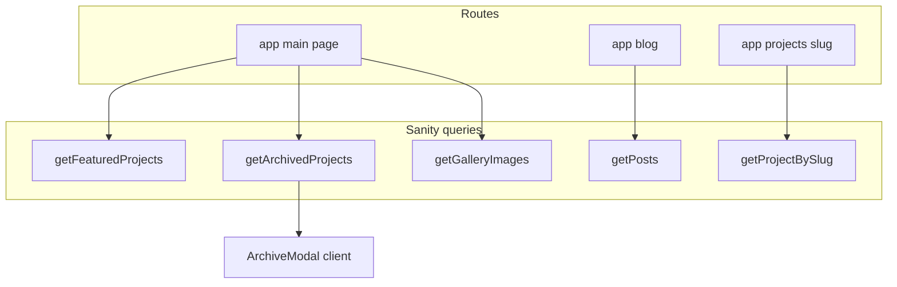

# Implementation plan: Archive modal & blog integration

**Superdesign source**

- Project: `67c3776a-4aef-441f-9d96-f5cce92e54bd`
- Draft: **Ademola | Archive Modal & Blog Integration** — `b847a791-db44-4888-a365-203cf001d4bb`
- Preview: [p.superdesign.dev draft](https://p.superdesign.dev/draft/b847a791-db44-4888-a365-203cf001d4bb)
- Regenerate HTML locally: `superdesign get-design --draft-id b847a791-db44-4888-a365-203cf001d4bb --output ./reference.html`

**Related drafts in the same project** (for later passes)

| Draft | Title | Use |
|-------|--------|-----|
| `53843f77-c039-4398-b337-16b58a955100` | Journal — Blog Listing | `/blog` layout & cards |
| `fe440cdd-63d6-4e06-b7a2-6d6140e40a9a` | Article Detail | `/blog/[slug]` |
| `53aaa183-f12a-4d4d-94ef-44868f6ca7ae` | Zenith Pay Case Study | `/projects/[slug]` editorial case study |

---

## 1. What the draft contains (scope)

1. **Single-page marketing shell** with hash sections: `#work`, `#life`, `#about`, `#contact` (draft uses `<sd-component … name="Navigation">` / `Footer` — implement as real React).
2. **Blog / journal integration**: nav and hero link “clean code” / journal to the blog surface — map to **`/blog`** (not Superdesign preview URLs).
3. **Featured work**: large typographic rows + hover preview image + **Live** / **Case study** links (case study → `/projects/[slug]` when wired to Sanity).
4. **Browse Archive** CTA opening a **full-screen modal** (“The Vault”): scrollable grid of legacy/archive project cards, backdrop blur, close on backdrop / X / `Escape`, `body` scroll lock.
5. **Life** masonry-style gallery (draft uses static Unsplash — map to **`getGalleryImages()`** or keep hybrid).
6. **Visual system**: charcoal `#080808`, olive `#708238`, **Cabinet Grotesk** + **Satoshi** (Fontshare), noise grain overlay, custom scrollbar, `fadeInUp` / scroll observer patterns, optional `cursor: crosshair` (consider reduced-motion and a11y).

---

## 2. Gap analysis vs current codebase

| Area | Today | Target (from draft) |
|------|--------|----------------------|
| Home | Minimal sections, multi-route CTAs | Long-form landing + section anchors; optional “single page” hero |
| Nav | [`components/layout/navbar.tsx`](../../components/layout/navbar.tsx) — routes only | Add **Journal → `/blog`**, optional in-page anchors (`#work`, `#life`, …) on `/` |
| Projects | `/projects` list pages | Featured rows on home + archive modal; keep `/projects` or deep-link |
| Modal | None | New client `ArchiveModal` + trigger |
| CMS | `project` schema has no “featured/archive” flag | Extend schema + GROQ (`featured`, `archived` or `sortOrder`) |
| Fonts | Geist | Add Cabinet Grotesk + Satoshi via `next/font` or Fontshare CSS |
| Icons | None | `lucide-react` (draft uses Iconify lucide icons) |

---

## 3. Recommended architecture (Next.js App Router)

- **Server components** for home sections that only need data.
- **`ArchiveModal`**: `"use client"`; receives `archivedProjects` as props from server parent (or lazy-fetch inside modal if list is huge — start with props).
- **URL strategy**: Keep **`/blog`** and **`/projects/...`**. On the homepage, replace draft’s `journalHref` preview URLs with **`/blog`** and case study links with **`/projects/[slug]`** from Sanity.

---

## 4. Schema & queries (Sanity)

Add fields on **`project`** (or a dedicated `archiveProject` type if you want separation):

- `featured` (boolean) — show in “Selected Works” on the homepage.
- `archived` (boolean) — show in archive modal only (or invert: `listedOnHome`).
- `year` (number) — card meta like “2023”.
- Optional: `previewImage` distinct from `images[]` for hover thumb.

**GROQ helpers** in [`lib/sanity.ts`](../../lib/sanity.ts):

- `getFeaturedProjects()` — `*[_type == "project" && featured == true] | order(...)`.
- `getArchivedProjects()` — `*[_type == "project" && archived == true]` (or `!featured` if you prefer convention over extra field).

Migrate existing content in Studio after deploy.

---

## 5. Component breakdown

| Component | Type | Responsibility |
|-----------|------|----------------|
| `GrainOverlay` | client or static div | Fixed full-screen noise SVG, pointer-events none |
| `HomeHero` | server + small client for clock | Lagos time (`Intl`, `Africa/Lagos`), headline, intro, link to `/blog` |
| `FeaturedWorkSection` | server | Maps Sanity featured projects; row layout + `next/image`; links to `liveUrl`, `/projects/slug` |
| `BrowseArchiveButton` | client | Calls modal open |
| `ArchiveModal` | client | Overlay, focus trap, ESC, scroll lock; grid of archived cards |
| `LifeGallerySection` | server | `columns-*` masonry; data from `getGalleryImages()` |
| `AboutSection` | server | Narrative + stack lists (static or CMS later) |
| `SiteFooter` | server | Replace/enhance [`components/layout/footer.tsx`](../../components/layout/footer.tsx) to match draft footer intent |
| `Navbar` | server | Props or config for `activeSegment`; **Blog** → `/blog`; on home, use `Link href="/#work"` etc. |

**Draft placeholders**: `<sd-component … Navigation/Footer>` → implement in React; do not ship `sd-component` tags in production.

---

## 6. Styling & tokens

1. Extend [`styles/globals.css`](../../styles/globals.css) / `@theme` with draft olive `#708238`, charcoal `#080808`, off-white `#f5f5f5`, grain class, scrollbar utilities, `@keyframes fadeInUp` (or use Framer Motion equivalents).
2. Load **Cabinet Grotesk** + **Satoshi** — prefer **`next/font/local`** woff2 if licensed, or document Fontshare link + `display: swap`.
3. Align Tailwind classes with existing `olive-*` scale where possible to avoid duplicate token names.
4. **Accessibility**: optional crosshair cursor; respect `prefers-reduced-motion` for animations; modal: initial focus, `role="dialog"`, `aria-modal="true"`, labelled title.

---

## 7. Blog integration (this pass vs next)

**This pass (minimal)**

- Navbar: ensure **Blog** / Journal points to **`/blog`**.
- Hero / intro: internal link to **`/blog`** instead of draft preview host.
- Optional: match spacing/typography to draft using shared `prose` / heading classes.

**Next pass** (fetch designs)

- Apply **Journal — Blog Listing** draft (`53843f77-…`) to [`app/blog/page.tsx`](../../app/blog/page.tsx).
- Apply **Article Detail** draft (`fe440cdd-…`) to [`app/blog/[slug]/page.tsx`](../../app/blog/[slug]/page.tsx).

---

## 8. Implementation phases (execution order)

1. **Superdesign init** (per [INIT.md](https://raw.githubusercontent.com/superdesigndev/superdesign-skill/main/skills/superdesign/INIT.md)): populate `.superdesign/init/` (`components.md`, `layouts.md`, `routes.md`, `theme.md`, `pages.md`, `extractable-components.md`) so future design iterations have repo context.
2. **Schema + queries**: featured/archived fields; `getFeaturedProjects`, `getArchivedProjects`.
3. **Fonts + global theme**: grain, scrollbar, animation tokens; wire fonts in root layout.
4. **Navbar + footer**: journal/blog link, section links on homepage.
5. **Homepage sections**: hero (with clock client island), featured work from Sanity, life gallery from Sanity, about, contact CTA.
6. **`ArchiveModal` + Browse Archive**: client component; pass archived projects; motion for open/close (Framer Motion optional).
7. **Project rows**: hover image (draft CSS — port to Tailwind + `group-hover`); ensure images from Sanity `urlForImage`.
8. **QA**: `npm run build`, keyboard + screen reader spot-check on modal, Lighthouse basics.

---

## 9. Out of scope (unless you expand the ticket)

- Pixel-perfect clone of unrelated drafts (case study page, full blog art direction) — track as separate tasks with their draft IDs.
- Replacing Unsplash in the draft with your real assets — use Sanity once content exists.
- `superdesign` CLI component extraction (`create-component`) — only needed if you iterate further **inside** Superdesign with shared DraftComponents.

---

## 10. Agent / human workflow note

Per [Superdesign SOP](https://raw.githubusercontent.com/superdesigndev/superdesign-skill/main/skills/superdesign/SUPERDESIGN.md): implement application code **after** you approve this plan (or say explicitly to skip design approval). This document is the agreed implementation map from the fetched draft HTML.
